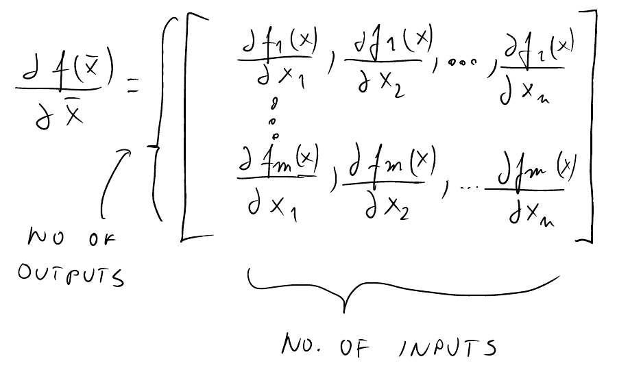
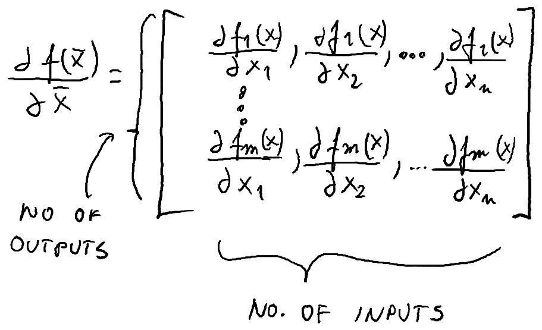

# Onyx Boox note renderer

Renders PDF files from Onyx Boox Note app backup zip file.

Tested with Onyx Boox Note Pro, Firmware 2.1.2.

## What can it do?

It can read the backup file (a collection of SQLite databases) and reder PDFs out of them.

It applies moving average to the strokes, so the resulting notes look super nice compared to the official export.

The text transcription of each stroke is also available in the files, so it could be overlaid on the PDF in order to be searchable, but this is not done here.

## Rendering quality

Output of this program:


Official Onyx export:


## Installation

### Unix (Linux/Mac)

Python 3 is required.

```bash
pip3 install -r requirements.txt
```

### Windows

Check out [onyx_renderer.exe](https://github.com/xdever/OnyxNoteRenderer/releases/download/v0.2/onyx_render.exe) and [fix_pdf.exe](https://github.com/xdever/OnyxNoteRenderer/releases/download/v0.3/fix_pdf.exe) from the Releases page.

## Usage

### Rendering notes

Turn on the WiFi on your device (because of the bug in the reader that doesn't let you to create a backup of notes without WiFi enabled), go to the note app, select the three-line-menu from the top, Backup and Recover, select the floppy disc icon, choose a filename, click ok. Wait until the notes are exported. Connect the device to your computer, and copy over the zip file generated. It is in folder note/backup/local/<the filename you entered above>.zip. Copy that over to the computer, and run this tool on it.

```bash
./onyx_render.py Note.zip notes 
```

It will create a new directory *notes* with the same directory structure as in the reader's Note app and render each note as a pdf inside.

### Fixing an annotated PDF

Supports both pressure sensitive and pressure insensitive ink.

```bash
./fix_pdf.py source.pdf smoothed.pdf
```

It can also work in-place if the 2nd argument is omitted.

## File format

### ShapeDatabase.db 

A file describing the names and directory structure of the notes. 
Table NoteModel has many interesting fields:
```
uniqueId: the identifier of the note/directory. In case of note, this is also the filename
parentUniqueId: the uniqueId of parent directory
title: human readable filename
type: 0 - dir, 1 - note    
pageNameList: the list of page IDs in correct order. Needed to recover page order.
``` 

### UID.db

These are the individual notes, where the UID matches the uniqueId from the ShapeDatabase.db. The strokes are saved in table NewShapeModel:

```
points - a binary blog of points. See later
thickness - line thickness
matrixValues - transformation matrix
pageUniqueId - the page containing this stroke
color - the color of the stroke. Bits 0-7 is B, bits 8-15 is G, bits 16-23 is R.
shapeType - 5 for pressure sensitive pen, 2 for the pressure-agnostic pen
```

The transformation matrix describes an affine transformation of each point in homogeneous coordinate system. Coordinates must be projected by this matrix before rendering.

#### The points blob

This describes the actual points of the drawing. Each point uses 24 bytes of data. The first 8 are the X, Y coordinates in *big endian* float32. The next 4 is the pressure in the big endian float32. It's value seems to be between 0-6000. I haven't tried to decode the rest.

## Acknowledges

Thanks for gubi for debugging Windows version and old note format.
